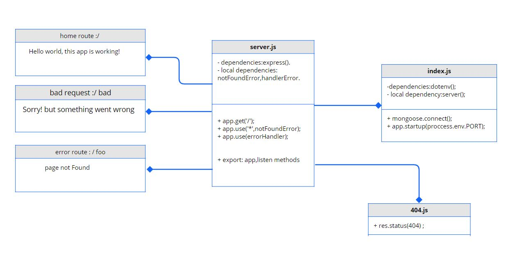

# server-deployment-practice

***This a practice to deploy a web app and test it using CI environment (Github Actions)***

## Author: Tamara Alrashed

## Here you can check the deployment for class-01 assignment:
[deployment for this dev branch](https://tamara--server-deploy-dev.herokuapp.com/).

[deployment for this main ](https://tamara--server-deploy-prod.herokuapp.com/).

[PR ](https://github.com/Tamaraalrashed/server-deployment-practice/pull/3).

## Setup

.env requirements

PORT - 3000

## Running the app
`npm start`

 

## UML

